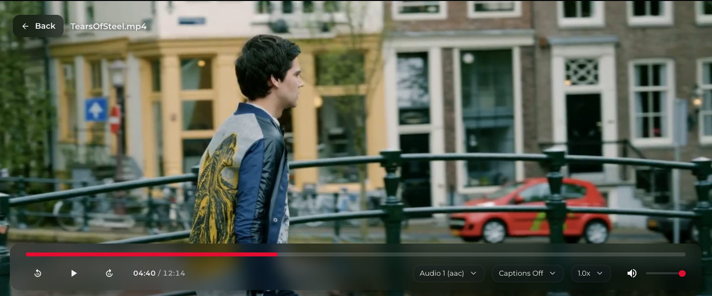
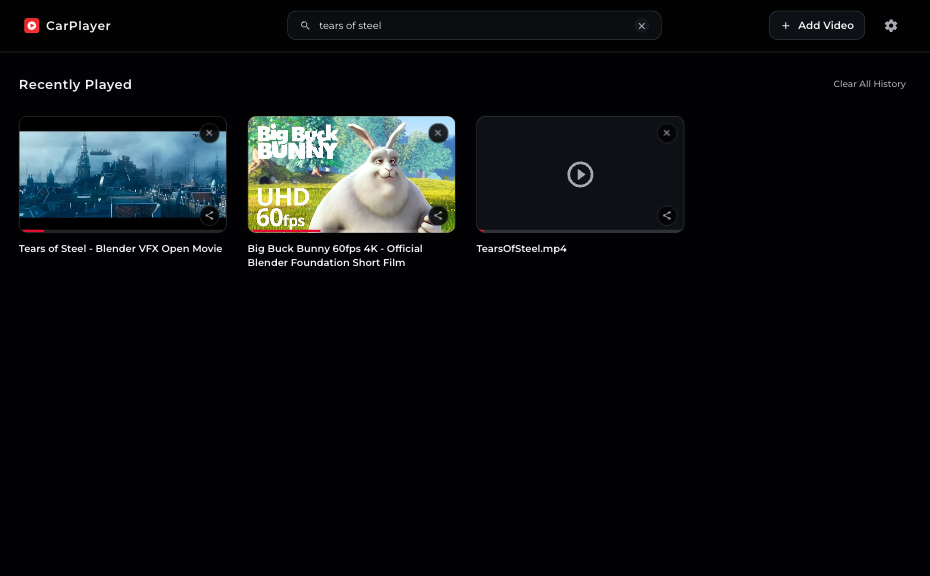
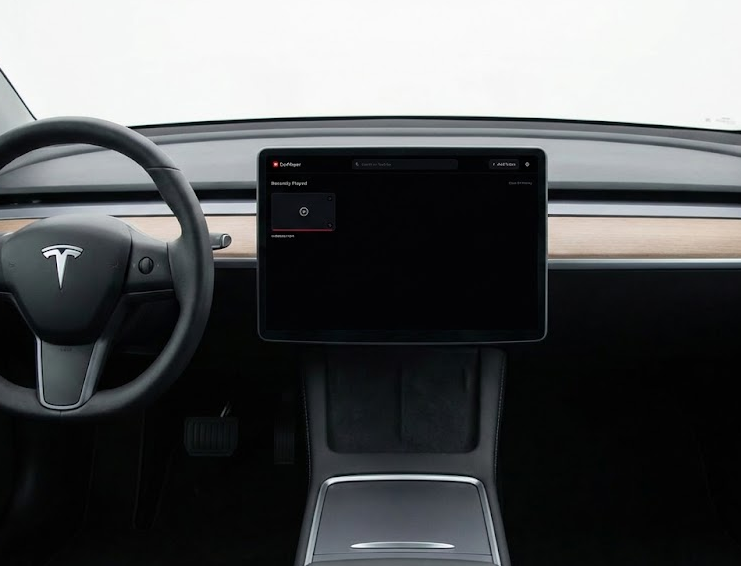

#  CarPlayer

A simple web video player that lets passengers, especially kids, watch videos while driving by bypassing standard in-car
entertainment restrictions.

> Disclaimer: Use responsibly. This project is intended for passengers only. The driver must stay focused on the road at
> all times.

## How to use in the car

1. Open your car's browser.
2. Go to: <https://carplayer.oxyconit.com/>.
3. Click 'Add Video'.
4. Scan the QR code with your phone or type a direct .mp4 link manually.
5. Paste the video link on your phone and tap 'Send to Car'.
6. Watch

## Functions

- Play videos from direct links (sent via QR code or entered manually).
- Play videos from your Jellyfin server.
- Search for Jellyfin videos directly in the app.
- Save your recent viewing history.
- Control the playback speed.
- Resume videos from where you left off.
- Save your volume, subtitles and playback speed settings between sessions.
- All played recently, settings, api keys are stored locally in your browser.
- Select audio, captions and video quality when using Jellyfin.
- Large buttons designed for car displays
- Go full-screen on Tesla cars.
- Share links from your mobile phone to your car without having to type long URLs.

## Relay backend (VPS)

QR code sharing sends small payloads through a short-lived HTTP relay session:

1. Car creates a relay session (`sessionId`, `readToken`, `writeToken`) with TTL.
2. QR contains only `sessionId` + `writeToken`.
3. Phone sends payload (`video-url`, `jellyfin-config`, `caption-url`, `redirect-url`) to relay.
4. Car polls relay and consumes queued payloads.

Why not P2P? It avoids LTE/hotspot NAT issues entirely because it is an HTTPS relay

### Deploy QR relay on your VPS (Docker Compose)

Start from project root: `docker compose up -d --build`

## Screenshots





## Development

We use vanilla HTML, CSS and JS files - we don't need any bundler or compiler.

### Installation

```bash
git clone git@github.com:KamilDzierbicki/carplayer.git
cd carplayer
```

### Run locally

### Option 1: Go Server (Recommended, required for sharing link via QR code) - 

```
go run main.go
```
*The app will be available at `http://localhost:8080/`. This runs both the static site and the relay backend.*

### Option 2: Easy and fast

Just open `index.html` in your browser without any server.

## Contributing

Contributions are welcome.

The status of this project is POC. When I have time, I will rewrite it using a more modern approach.
I did a lot of testing and debugging, so a lot of dead code left.

1. Fork the repository.
2. Create a feature branch:`git checkout -b feature/my-change`
3. Make focused changes in small commits.
4. Run manual checks locally.
5. Open a Pull Request with:
    - what changed,
    - why it changed,
    - how it was tested (steps/screenshots/GIF if UI impact).

## License

This project is licensed under the MIT License.
